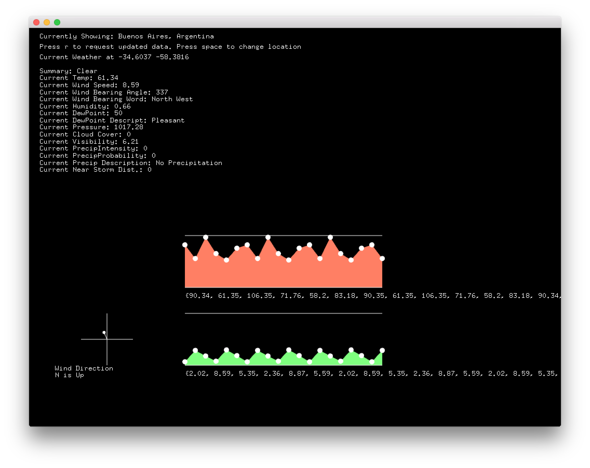

#Quick Addon for OF + Forecast.io

This was made for OF 0.9.3 on OSX but should be just fine crossplatform since it's just using `ofLoadURLAsync()` behind the scenes. Requires ofxJSON - which is eventually going to be in the core for the next OF version.

To use this and the example, you will need an API key from [Forecast.io](https://developer.forecast.io)'s developer portal. You can either put the API key directly in your code, or put it in a text file in your data folder at named apikey.txt and follow the example.

There would still be a lot to do here and probably some smarter ways to manage the data, but it works for basic stuff. There are plenty of data points that I didn't expose. Most of this is only for the "Current Time" but Forecast.io offers the ability to go back in time and also provide the upcoming forecast for the next week. See all possible data points [here](https://developer.forecast.io/docs/v2)

**You're limited to 1000 API calls per day for the free tier, so be super careful about how you're querying - don't do it every frame**

The MIT License (MIT) Copyright (c) 2016 Fake Love

Permission is hereby granted, free of charge, to any person obtaining a copy of this software and associated documentation files (the "Software"), to deal in the Software without restriction, including without limitation the rights to use, copy, modify, merge, publish, distribute, sublicense, and/or sell copies of the Software, and to permit persons to whom the Software is furnished to do so, subject to the following conditions:

The above copyright notice and this permission notice shall be included in all copies or substantial portions of the Software.

THE SOFTWARE IS PROVIDED "AS IS", WITHOUT WARRANTY OF ANY KIND, EXPRESS OR IMPLIED, INCLUDING BUT NOT LIMITED TO THE WARRANTIES OF MERCHANTABILITY, FITNESS FOR A PARTICULAR PURPOSE AND NONINFRINGEMENT. IN NO EVENT SHALL THE AUTHORS OR COPYRIGHT HOLDERS BE LIABLE FOR ANY CLAIM, DAMAGES OR OTHER LIABILITY, WHETHER IN AN ACTION OF CONTRACT, TORT OR OTHERWISE, ARISING FROM, OUT OF OR IN CONNECTION WITH THE SOFTWARE OR THE USE OR OTHER DEALINGS IN THE SOFTWARE.